# MERN Stack
## 1. Launch and Connect to EC2

* Launch an EC2 instance: search ec2 - click launch instance - Name the instance (Ecommerce-sever) - select Amazon linux as AMI OS - instance type (t3 micro free tier) - create new key pair and download - setup security group - launch instance.

Below shows the instance in running state

## 2. Connect to the EC2 instance through ssh: 
 Once my instance started running, I connected to it from my local machine using ssh by running the command - **ssh -i "C:\Users\user\Documents\MY_PBL\MERN-ec2\MERN-ec2.pem" ec2-user@13.51.237.162**. The result is shown below
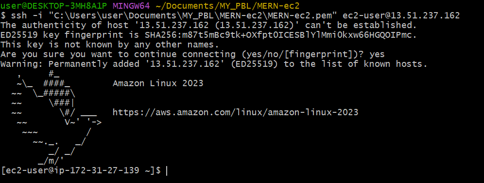

### 3. Since I am  using Amazon Linux 2023, which is based on Fedora/RHEL rather than Debian/Ubuntu. In Amazon Linux, apt is not available because it uses dnf (or yum in older versions) as the package manager.

* Next step is to first update the system using - **sudo dnf update -y**
* Then install node.js using the command **sudo dnf install -y nodejs**
* Check the version installed using **node -v** and **npm -v**
This is shown below

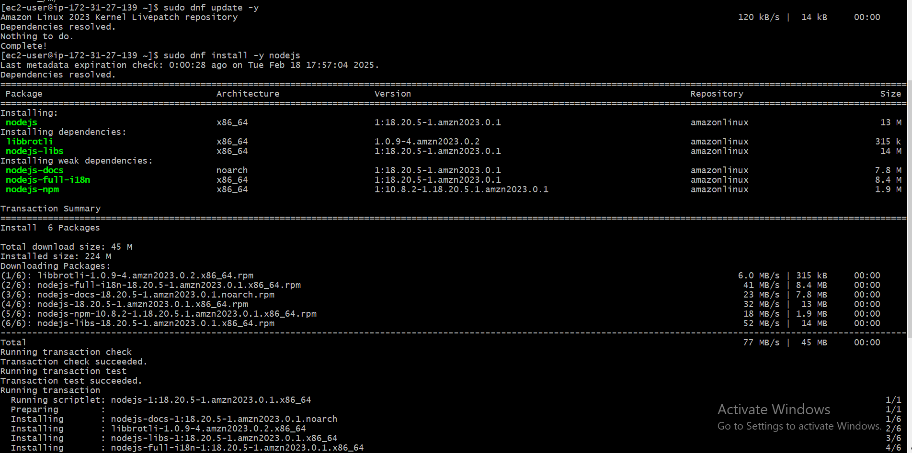

## 4. Next step is installing MongoDB

* Start by adding the MongoDB repository
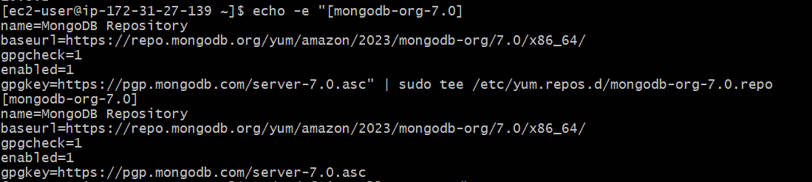

* Install MongoDB - **sudo dnf install -y mongodb-org**
* Start MongoDB on boot - **sudo systemctl start mongod** 
* Enable MongoDB on boot - **sudo systemctl enable mongod**

The image of this installation is shown below

* Verify MongoDB is running - **sudo systemctl status mongod**

The proof of mongoDB running is shown below

    

## 5. Push your changes to the remote repository

* To be able to push your changes to the remote repostitory, first install git - **sudo yum install git**
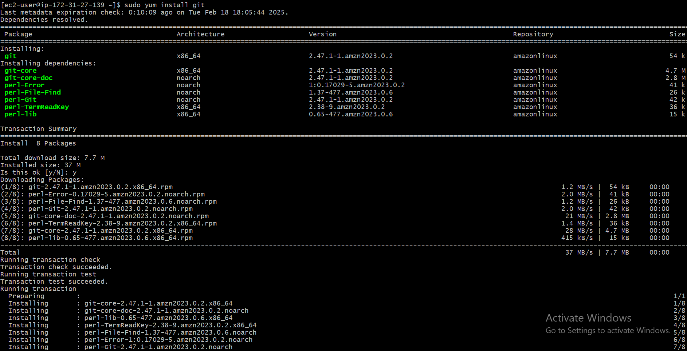

* Then after pushing you changes to the remote repository, you have to clone your remote repository using - **git clone  https://github.com/olamidey-io/Project8---MERN-stack.git** and then cd into it - **cd Project8---MERN-stack**. Image of these shown below

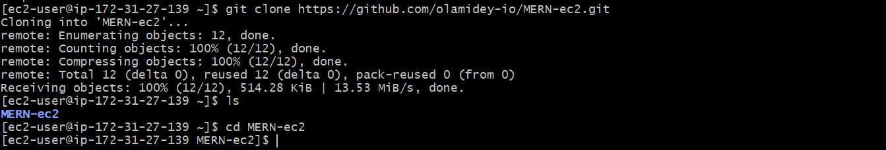

## 6. Install Backend Dependencies
* verify that package.json file is in your directory - **ls -la.** The package.json file is very important as it defines your project (name, version, description, author, etc.). It also tracks dependencies (express, mongodb, dotenv, etc.), so others can install them with npm install. It stores scripts (e.g., "start": "node index.js" to run your app). It also helps with version control and project portability.
* if the file is missing, then manually add it by running **npm init -y** to create the file with some basic fields
* And then install dependencies using **npm install cors dotenv express mongodb**

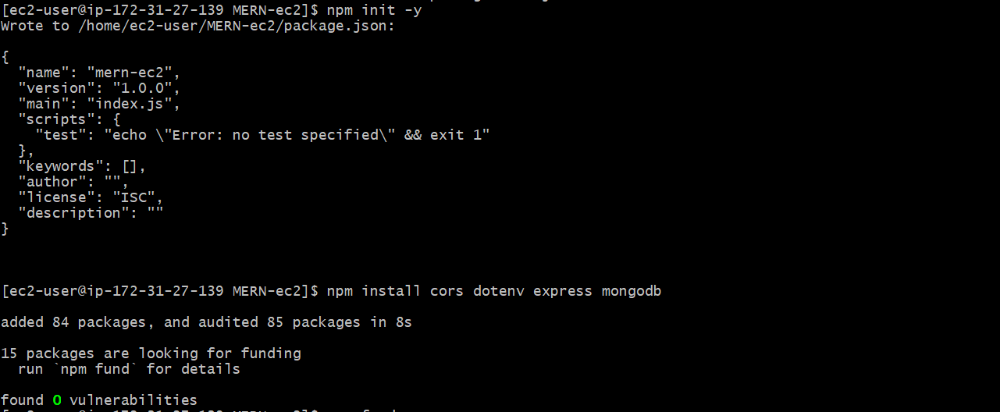

* Check the file using - **cat package.json**
This is shown below
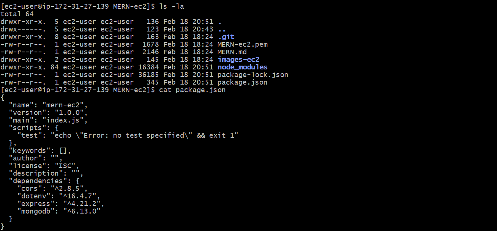

This is what the package.json file contains
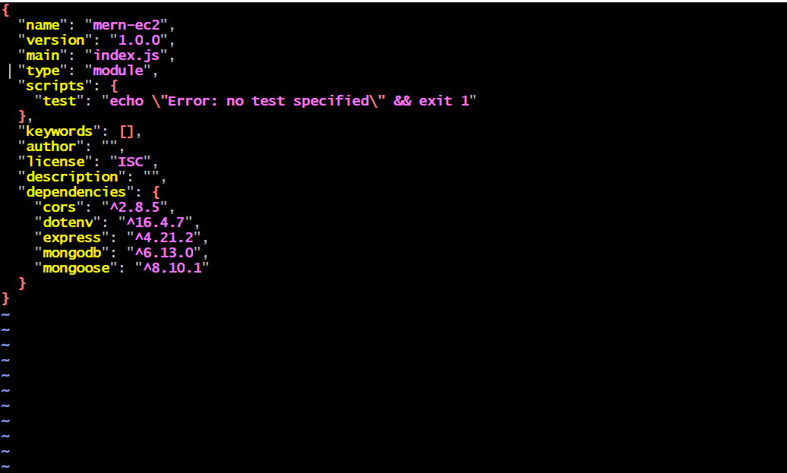

* Then stage the changes as shown below
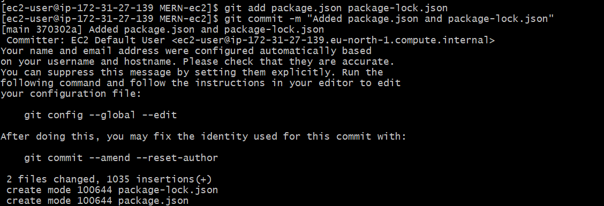

* After staging, i pushed the changes to the repo using password access token (PAT) as shown below
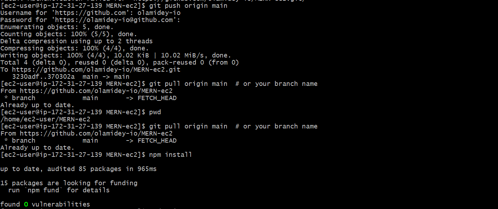

* For my environment variable, i created my .env file using - **sudo vi .env** and added my mongoDB connection string.
* The .env should contain 3 things:
    * Localhost (Server Address) → This is usually 127.0.0.1
    * Port → The default MongoDB port is 27017
    * Database Name → You can choose or check the database name inside MongoDB.

* To check if mongoDB is running on the default port, run - **sudo netstat -tulnp | grep mongod** as shown below

* To get the database name, login to the mongoDB shell using **mongosh**, then **show dbs**. if no database name is listed, create a new database name using **use MERN-databse**. Then insert a sample data - **db.users.insertOne({ name: "Olamide", email: "ibrahimolamide999@gmail.com" })**. Then verify again if database name now exits by running show dbs.

Image of this shown below:
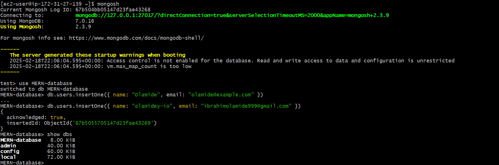

* The .env file is shown below
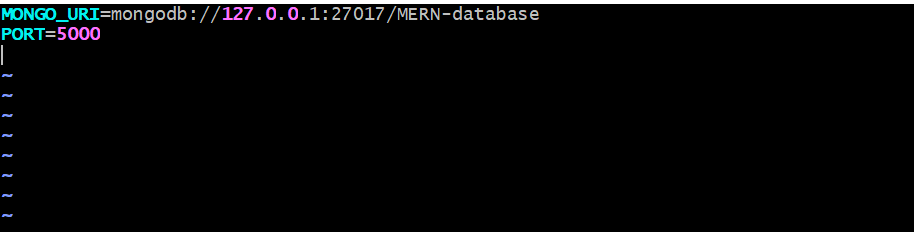

* Then i added  server.js, which is the main entry point of my Node.js server. using **sudo vi server.js** i added the code to the file as shown below:

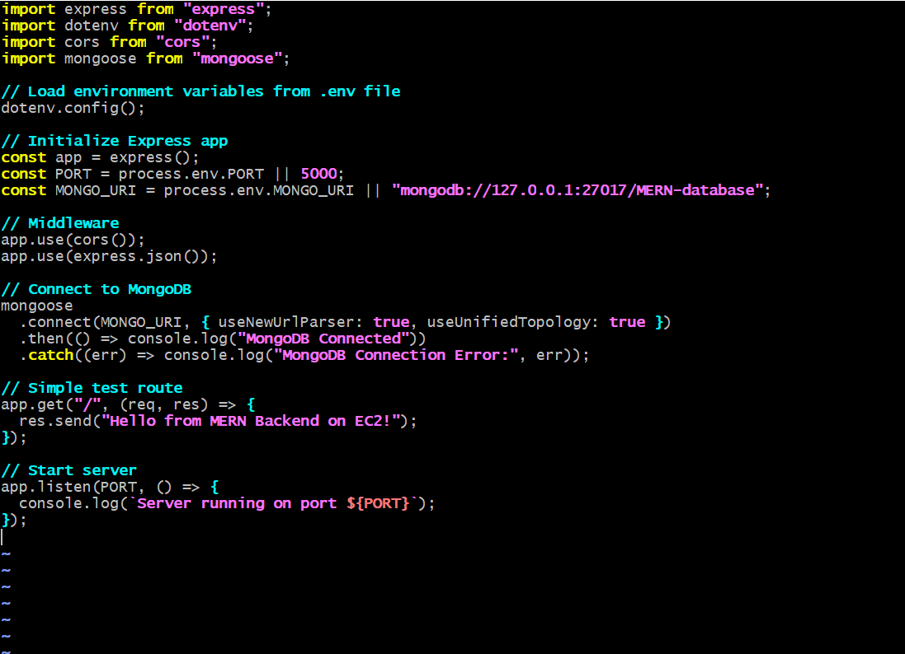

* Then i started the server using - **noder server.js**. Below is an image showing my server running and mongoDB connecteed!
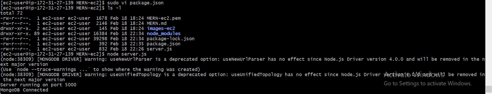

## 7. Build and Serve the React Frontend

