# MERN Stack
## 1. Launch and Connect to EC2

* Launch an EC2 instance: search ec2 - click launch instance - Name the instance (Ecommerce-sever) - select Amazon linux as AMI OS - instance type (t3 micro free tier) - create new key pair and download - setup security group - launch instance.

Below shows the instance in running state

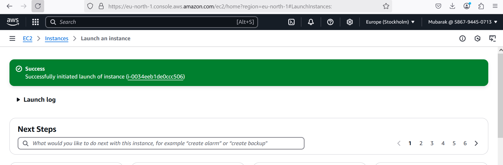

## 2. Connect to the EC2 instance through ssh: 
 Once my instance started running, I connected to it from my local machine using ssh by running the command - **ssh -i "C:\Users\user\Documents\MY_PBL\MERN-ec2\MERN-ec2.pem" ec2-user@13.51.237.162**. The result is shown below

### 3. Since I am  using Amazon Linux 2023, which is based on Fedora/RHEL rather than Debian/Ubuntu. In Amazon Linux, apt is not available because it uses dnf (or yum in older versions) as the package manager.

* Next step is to first update the system using - **sudo dnf update -y**
* Then install node.js using the command **sudo dnf install -y nodejs**
* Check the version installed using **node -v** and **npm -v**
This is shown below

## 4. Next step is installing MongoDB

* Start by adding the MongoDB repository

* Install MongoDB - **sudo dnf install -y mongodb-org**
* Start MongoDB on boot - **sudo systemctl start mongod** 
* Enable MongoDB on boot - **sudo systemctl enable mongod**

The image of this installation is shown below
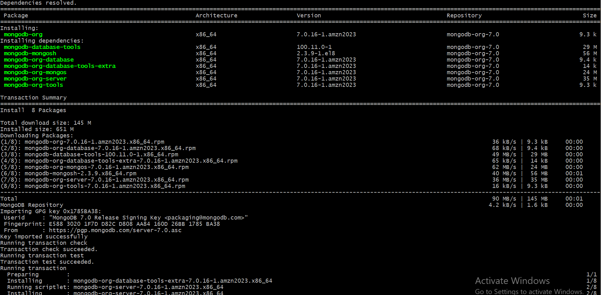

* Verify MongoDB is running - **sudo systemctl status mongod**

The proof of mongoDB running is shown below

    

## 5. Push your changes to the remote repository

* To be able to push your changes to the remote repostitory, first install git - **sudo yum install git**

* Then after pushing you changes to the remote repository, you have to clone your remote repository using - **git clone  https://github.com/olamidey-io/Project8---MERN-stack.git** and then cd into it - **cd Project8---MERN-stack**. Image of these shown below

## 6. Install Backend Dependencies
* verify that package.json file is in your directory - **ls -la.** The package.json file is very important as it defines your project (name, version, description, author, etc.). It also tracks dependencies (express, mongodb, dotenv, etc.), so others can install them with npm install. It stores scripts (e.g., "start": "node index.js" to run your app). It also helps with version control and project portability.
* if the file is missing, then manually add it by running **npm init -y** to create the file with some basic fields
* And then install dependencies using **npm install cors dotenv express mongodb**

* Check the file using - **cat package.json**
This is shown below

This is what the package.json file contains

* Then stage the changes as shown below

* After staging, i pushed the changes to the repo using password access token (PAT) as shown below

* For my environment variable, i created my .env file using - **sudo vi .env** and added my mongoDB connection string.
* The .env should contain 3 things:
    * Localhost (Server Address) → This is usually 127.0.0.1
    * Port → The default MongoDB port is 27017
    * Database Name → You can choose or check the database name inside MongoDB.

* To check if mongoDB is running on the default port, run - **sudo netstat -tulnp | grep mongod** as shown below
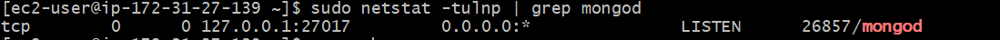

* To get the database name, login to the mongoDB shell using **mongosh**, then **show dbs**. if no database name is listed, create a new database name using **use MERN-databse**. Then insert a sample data - **db.users.insertOne({ name: "Olamide", email: "ibrahimolamide999@gmail.com" })**. Then verify again if database name now exits by running show dbs.

Image of this shown below:

* The .env file is shown below

* Then i added  server.js, which is the main entry point of my Node.js server. using **sudo vi server.js** i added the code to the file as shown below:

* Then i started the server using - **noder server.js**. Below is an image showing my server running and mongoDB connecteed!

## 7. Build and Serve the React Frontend

Now that your backend (Node.js + Express + MongoDB) is running, it's time to set up, build, and serve your React frontend on your EC2 instance.

Now, create your frontend inside the MERN-project folder using **npx create-react-app client**. This creates a client folder and sets up a React project inside it as shown below.
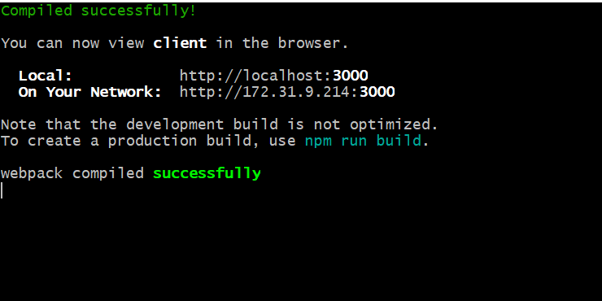

Then run **npm run build**
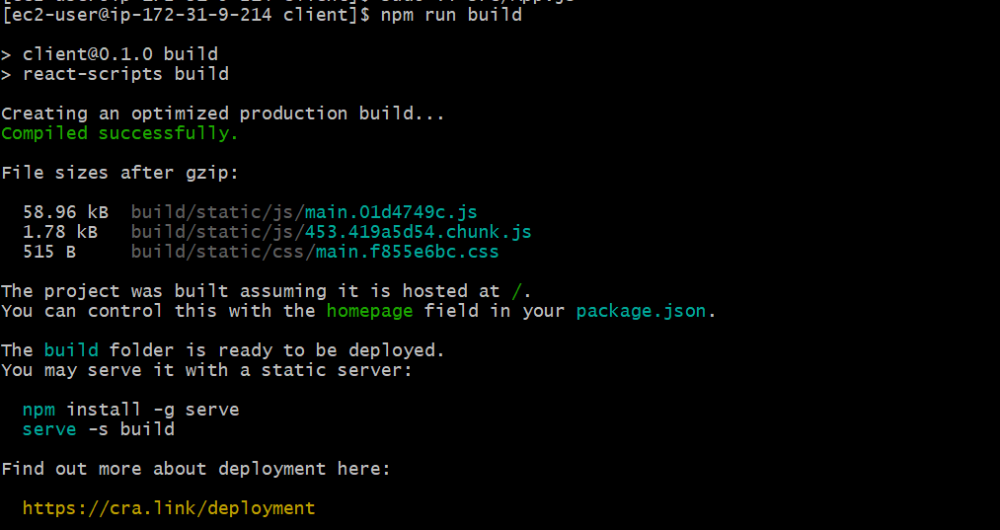

The build was successful, but the issue now is a permission error when trying to install serve globally by running **sudo npm install -g serve** as shown below
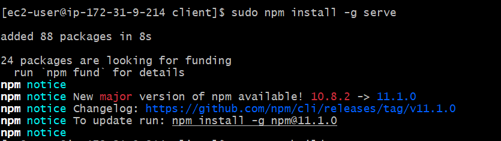

Then serve your react app by running **serve -s build** as shown below
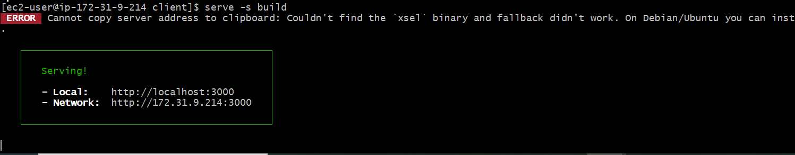

## **Accessing my app on the browser**
Then i tried accessing it on my browser by visiting my instance public ip with - **http://<your-ec2-public-ip>:3000** as shown below:
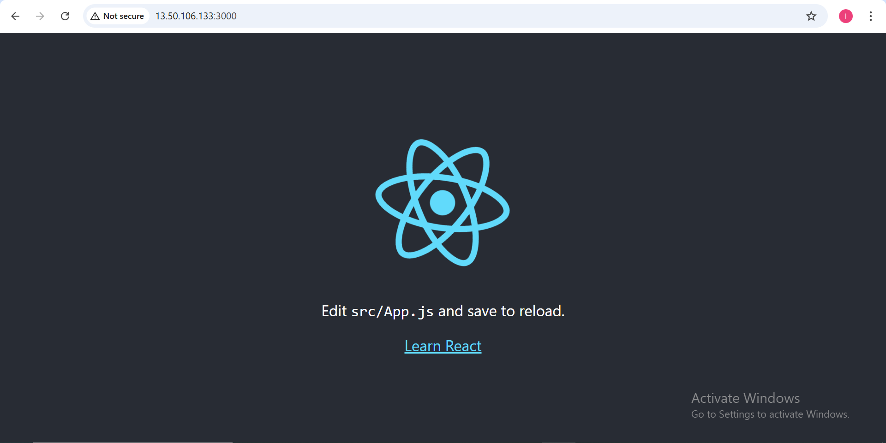

## **Step 9: installing and configuring nginx as a reverse proxy**

My React app is currently being served using **serve -s build -l 3000**, but this method isn’t ideal for production because:
* The server stops when you close the terminal.
* It’s not optimized for handling traffic.

### Solution? Use Nginx as a reverse proxy!
A reverse proxy is a server that sits between your users and your actual application. Instead of users directly accessing your React app on port 3000, they access Nginx on port 80 (default HTTP port), and Nginx then forwards the request to your React app.

**Installing Nginx**
Exit from the client and remote repository project directory and change directory to connection to your instance, then run - **sudo yum install nginx -y** as shown below.
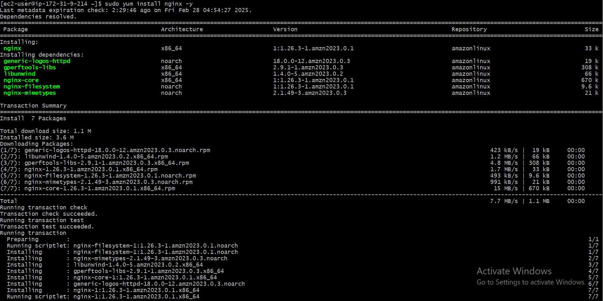

Start the nginx service using - **sudo systemctl start nginx**, then enable it to start on boot using - **sudo systemctl enable nginx**
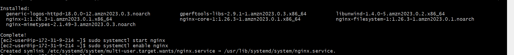

Then confirm nginx is running using - **system ctl status**
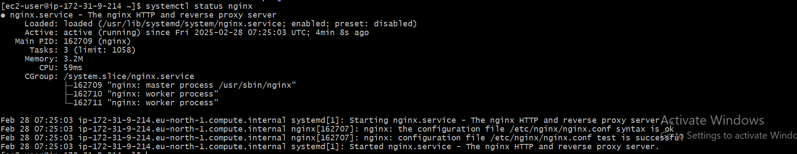

**Create a new nginx configuration file**
Run - **sudo vi /etc/nginx/conf.d/mern.conf** and paste the configuration inside it as shown below:
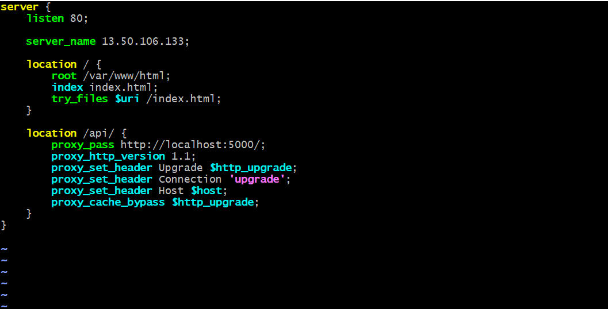

To test if its actually working, i visisted my ec2 public ip on my browser to load nginx default page as seen below
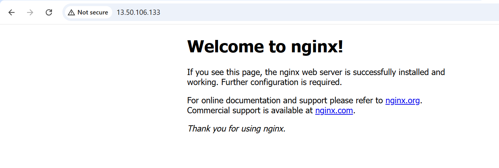

**Move my react build to the nginx root folder**
My React app's production files are inside the build folder. Move them to **/var/www/html/:**
* **sudo rm -rf /var/www/html/***
* sudo cp -r ~/MERN_ec2/client/build/* /var/www/html/

So below is my app being accessed on the browser

